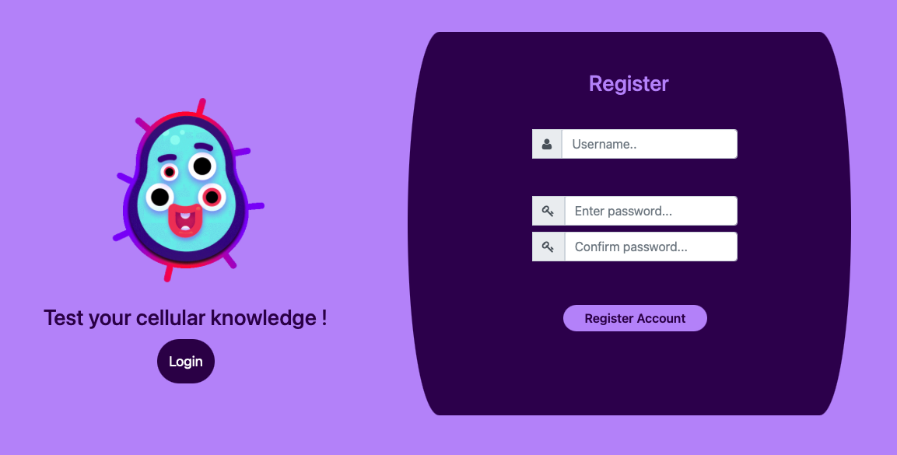
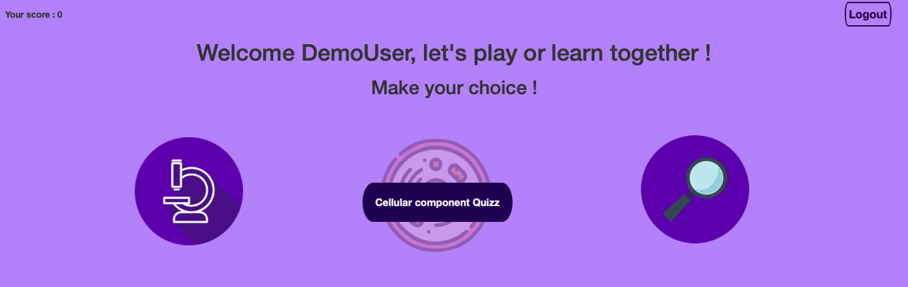
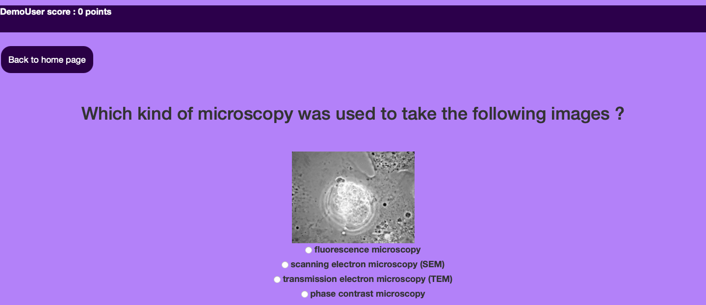
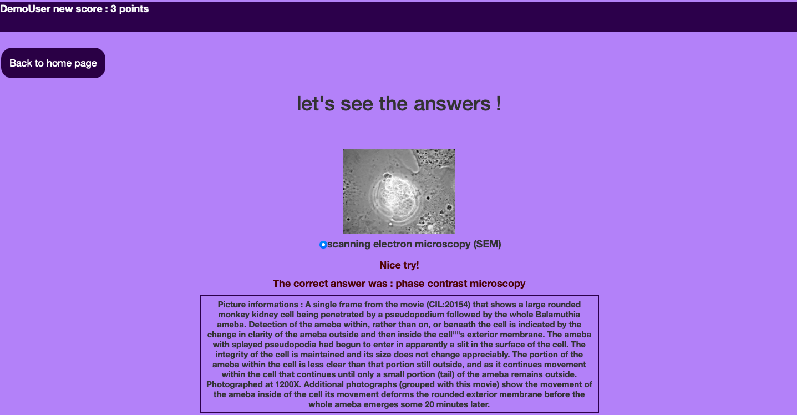
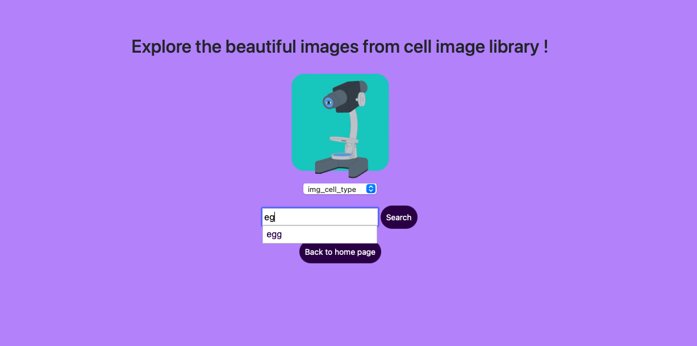
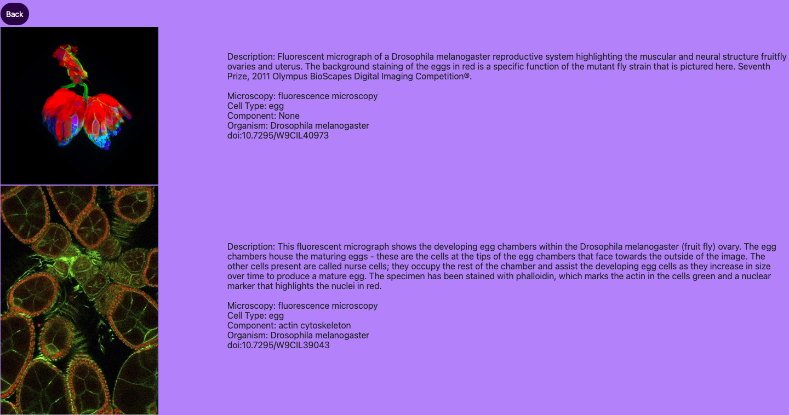

#Quizz_project developped with Django 


###M2-DLAD 
####2021-2022

## • Project general description 
The project is a website with two quizzes, one on the type of microscopy used to capture 
microscopy images, and the second is a quiz on the cellular components represented in the
microscopy images. In addition, the site allows the images to be searched by key words. 
In order to play and explore the data you need to register on the site and then log in 
to your account.

## • Project installation 
To run the project on your own machine, first you have to clone this directory with 
the following commands on your terminal : 

```{}
git clone https://github.com/Elise-11/Quizz_project
cd Quizz_project
```
Then it is necessary to install dependencies available in the django_env.yml file. 
You can create and activate a Conda environment with these dependencies from this file 
with the following commands :
```{}
conda env create -f django_env.yml
conda activate djangoenv
```
If you want to install Conda on your machine I invite you to consult this link: 
https://docs.conda.io/projects/conda/en/latest/user-guide/install/index.html

In order to initialize models we run migrations : 
```{}
./manage.py makemigrations 
./manage.py migrate
```

Finally to launch the server and then browse the site: 
```{}
./manage.py runserver
```

## • Navigation on the website

### Registration
The first step in exploring this site is registration 
in a form requiring a username and password 
(more than 9 characters long, must not be entirely numeric and different from your username).



### Login 
Then you will be asked to log in with your username and password you registered with. 
You will be redirected to a page where you can choose between quizzes and image exploration. 



### Quizzes
Two quizzes are available, let's see an example of the microscopy quiz. 

Tick the buttons that you think are the right answer. 



Then confirm your answers at the bottom of the page.


You will be redirected to the correction where you can see the correct answers, 
your new score and additional information about the images. 




### Exploration
Finally, it is also possible to search for images according to characteristics, 
for example we want to search for all images with egg cell type. 
We select img_cell_type in the drop-down list, then enter egg. 



Here are the results of our search. 




## Enjoy ! 
